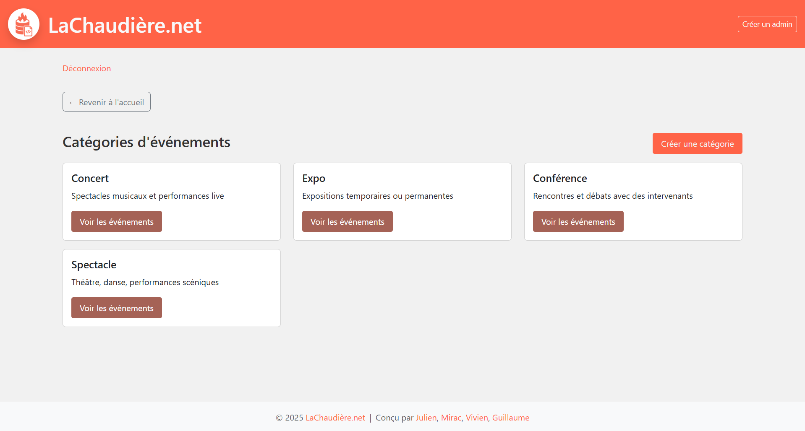
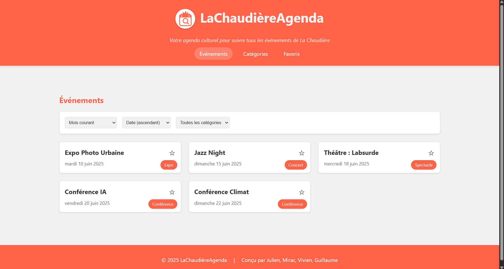

<p align="center">
  
</p>

# SAE-S4-DWM - La Chaudière Calendar

Projet de groupe réalisé dans le cadre du BUT Informatique S4 - Atelier de développement d’application web et mobile.

## 👥 Membres du groupe

- NOEL Julien
- DEMIRCI Mirac
- HESS Guillaume
- HERRMANN Vivien

> [Organisation du projet](https://github.com/users/juliennoel22/projects/4)

---

## 📚 Présentation générale

Ce projet vise à développer une solution complète pour la gestion et la consultation des événements culturels de **La Chaudière**.  
Il se compose de trois parties principales :

1. **Backend** (LaChaudièreAgenda.core) : application PHP dockerisée, gérant les données et proposant :
   - une interface HTML d'administration (création, modification, publication d'événements et de catégories, gestion des utilisateurs, accès réservé aux admins)
   - une API publique REST (consultation des événements et catégories au format JSON)
2. **Application Web** (LaChaudièreAgenda.web) : SPA JavaScript consommant l'API publique pour permettre la recherche, le filtrage, la consultation et la gestion des favoris d'événements.
3. **Application Mobile** (LaChaudiere.app) : application Flutter consommant l'API publique pour la consultation, la recherche, le filtrage, le tri et la visualisation détaillée des événements.

Chaque partie consomme la même API publique et propose des fonctionnalités adaptées à son support.

---

## 🛠️ Architecture du projet

```
SAE-S4-DWM-Chaudiere-Calendar/
├── backend/                # LaChaudièreAgenda.core (PHP, Docker)
├── calendar.appli.web/     # LaChaudièreAgenda.web (SPA JS)
├── chaudiere_app/          # LaChaudiere.app (Flutter)
└── Consignes/              # Cahier des charges et consignes
```

---

## 1️⃣ Backend - LaChaudièreAgenda.core

- **Technologies** : PHP, PostgreSQL, Docker
- **Fonctionnalités** :
  - Interface HTML d'administration pour la gestion des événements, catégories et utilisateurs (authentification requise)
  - Publication/dépublication des événements
  - API publique REST :
    - Consultation des événements et catégories (filtrage par période, catégorie, tri, etc.)
    - Détail d'un événement
    - Données au format JSON

**Exemple d’endpoint public** :  
`GET /api/evenements` - Liste tous les événements au format JSON.

**Capture d’écran - Application Backend PHP** 
 

---

## 2️⃣ Application Web - LaChaudièreAgenda.web

- **Technologies** : JavaScript, Handlebars, CSS
- **Fonctionnalités principales** :
  - Affichage de la liste des événements (mois courant, passés, futurs)
  - Filtrage par catégorie
  - Tri (date, titre)
  - Recherche par titre
  - Vue détaillée d’un événement
  - Gestion des favoris (localStorage)
  - Navigation entre événements, catégories, favoris
  - Conversion Markdown → HTML pour les descriptions

**Capture d’écran - Application Web**
  


---

## 3️⃣ Application Mobile - LaChaudiere.app

- **Technologies** : Flutter, Dart
- **Fonctionnalités principales** :
  - Liste des événements (recherche, tri, filtre par catégorie)
  - Vue détail d’un événement (description, image, date, lieu)
  - Thème clair/sombre
  - Navigation fluide Master/Détail

**Capture d’écran - Application Mobile**  


---

## 🚀 Lancer le projet

Depuis la racine du projet, exécutez :

```bash
docker compose up -d --build
```

> Si besoin de réinitialiser les volumes (base de données, etc.) :
>
> ```bash
> docker compose down -v
> ```

- Le **backend** (administration + API) sera accessible sur [http://localhost:8888/](http://localhost:8888/)
- Le **frontend web** sera accessible sur [http://localhost:3333/](http://localhost:3333/)

Vous pouvez aussi accéder directement aux applications via :
- [http://docketu.iutnc.univ-lorraine.fr:8888/](http://docketu.iutnc.univ-lorraine.fr:8888/) (backend)
- [http://docketu.iutnc.univ-lorraine.fr:3333/](http://docketu.iutnc.univ-lorraine.fr:3333/) (frontend web)

> **Remarque** : L'accès distant n'est possible que si vous êtes connecté au réseau de l'Université de Lorraine.

### Application Mobile

```bash
cd chaudiere_app
flutter pub get
flutter run
```

---

## 📄 Consignes et documentation

- Voir le dossier `Consignes/` pour le cahier des charges détaillé.
- Chaque sous-projet contient son propre README pour plus de détails techniques.

---

## 📝 Fonctionnalités détaillées

### Backend – LaChaudièreAgenda.core

- Interface HTML d'administration sécurisée (authentification requise)
- Création, modification, suppression d'événements
- Gestion des catégories (création, édition)
- Gestion des utilisateurs (création, authentification, contrôle d'accès)
- Publication/dépublication des événements
- Saisie des descriptions en Markdown (conversion HTML à l'affichage)
- API publique REST :
  - Liste des catégories (`/api/categories`)
  - Liste des événements (`/api/evenements`)
  - Liste des événements d'une catégorie (`/api/categories/{id}/evenements`)
  - Détail d'un événement (`/api/evenements/{id}`)
  - Filtrage par période (passée, courante, future)
  - Tri (date asc/desc, titre, catégorie)
- Données au format JSON

---

### Application Web – LaChaudièreAgenda.web

- SPA JavaScript (ES modules)
- Affichage de la liste des événements (mois courant, passés, futurs)
- Filtrage par catégorie
- Tri (date ascendante/descendante, titre)
- Recherche par titre
- Vue détaillée d’un événement
- Affichage de l'image associée à un événement (si présente)
- Gestion des favoris (ajout/suppression, persistance localStorage)
- Navigation entre événements, catégories, favoris
- Conversion Markdown → HTML pour les descriptions
- Manipulation dynamique du DOM (Handlebars)
- Appels asynchrones à l’API (fetch, promesses)
- Gestion des erreurs et feedback utilisateur

---

### Application Mobile – LaChaudiere.app

- Application Flutter (Dart)
- Affichage de la liste des événements (titre, catégorie, date)
- Recherche d’événements par titre (filtrage dynamique)
- Filtrage par catégorie
- Tri des événements (date asc/desc, titre, catégorie)
- Vue détail d’un événement (description, image, date, lieu, etc.)
- Thème clair/sombre (Provider)
- Navigation Master/Détail fluide
- Icône personnalisée et splash screen
- Chargement dynamique depuis l’API publique
- (Optionnel) Persistance locale via SQLite